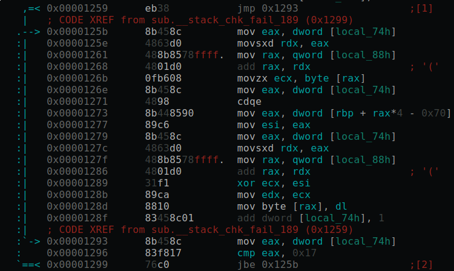
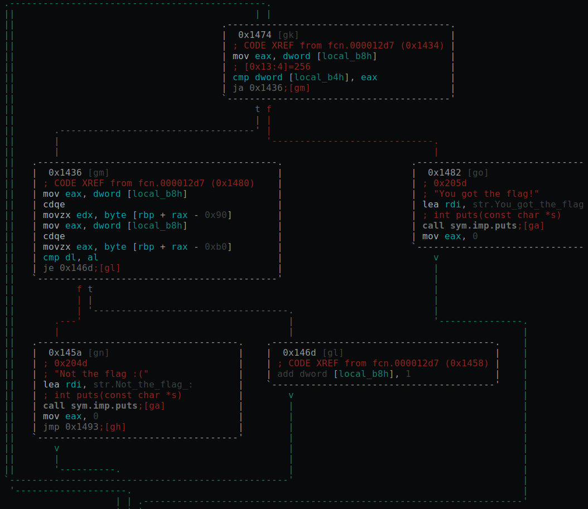
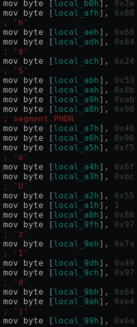
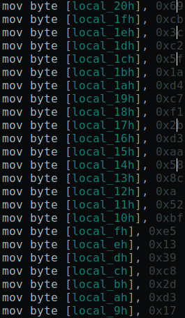

# Strippy

## Question Text

(っ•́｡•́)♪♬

*Creator - PotatoDurg*

## Distribution
- Strippy
    - SHA1: `cdedebd03bd621a1c599142c468c248f0968068e`
    - Stripped ELF 64 bit binary

## Solution

If we take a look at the main function we can see that it gets input and stripts off the newline. Then it checks that the input has length of 24. Which means our flag is 24 characters long.


If the input is 24 characters long another function is called, which basically XORs the input string with an array of bytes.


After the XOR function, the input values are compared with another array of bytes, and if they are all equal you have the right flag. So we just have to XOR the array of bytes in the main function with the array of bytes in the XOR function to get the flag.


Flag values after XOR



XOR values



Sample solution
```python
xor_values = [105, 203, 60, 194, 95, 26, 212, 199, 241, 43, 211, 170, 88, 140, 10, 82, 191, 229, 19, 57, 200, 45, 211, 23]
encrypted_values = [46, 136, 104, 132, 36, 83, 139, 171, 152, 64, 150, 245, 111, 188, 85, 1, 136, 151, 122, 73, 151, 100, 228, 106]
for i in range(len(encrypted_values)):
    print(chr(xor_values[i] ^ encrypted_values[i]), end='')
```

### Flag
`GCTF{I_likE_70_S7rip_I7}`
